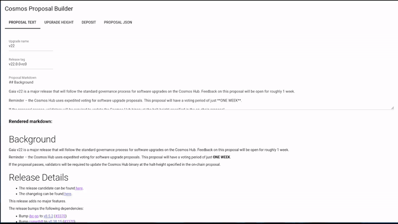

# cosmos-proposal-builder
Helps you build software upgrade proposals.

## Usage

### Python

* This will open a browser on localhost:8000.
```
python -m pip install -r requirements.txt
python src/main.py
```

### Docker

* This will serve the site on localhost:8000.
```
docker build -t proposal-builder .
docker run --rm -p 8000:8080 proposal-builder
```

